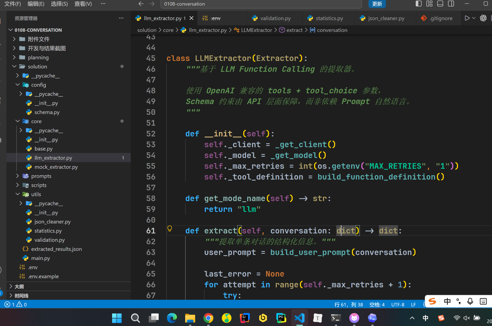
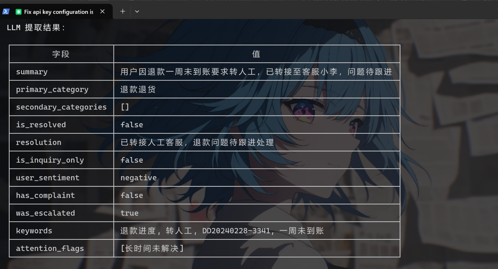
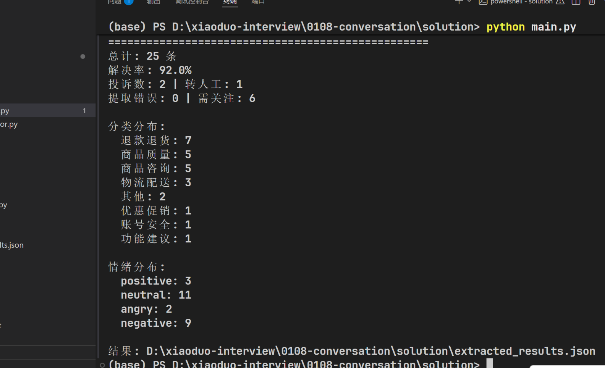
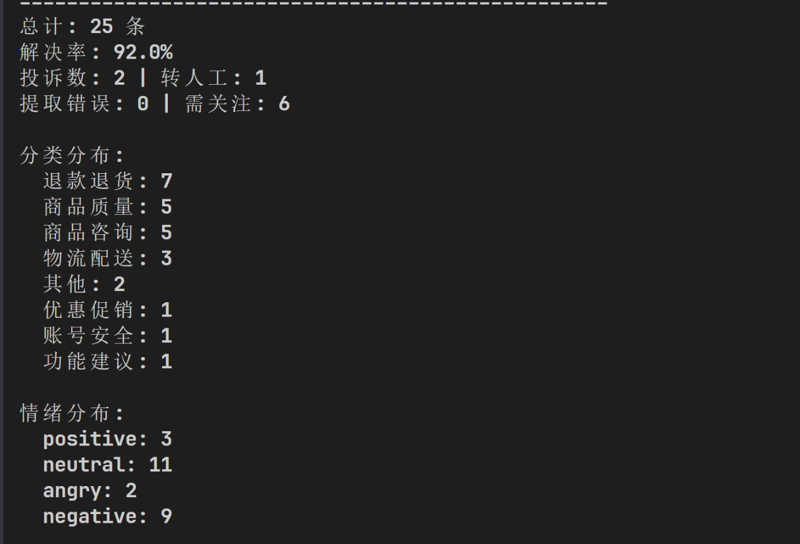

# 开发与结果截图说明

## 1. 开发环境

本项目使用 **VS Code** 作为代码编辑器，Python 3 作为开发语言，项目结构按分层架构组织（config / core / prompts / utils / main）。

## 2. Claude Code 辅助开发

开发全程使用 **Claude Code** 作为 AI 编程助手，完成以下工作：
- 头脑风暴分析需求，确定实现方案
- 设计 14 字段 Schema 体系（8 种问题分类、4 级情绪、5 类关注标记）
- 生成分层架构代码
- 编写和优化 System Prompt（角色 / 规则 / Few-shot 示例）
- Review 代码问题并修正
- 撰写 README 和说明文档

## 3. 终端运行截图

运行 `python main.py -v` 的实时输出效果：
- 逐条显示 `[1/25] ~ [25/25]` 提取进度
- 每条提取完成实时打印摘要、分类、情绪、解决状态
- 异常对话即时展示 `⚡ 关注` 标记
- 每完成一条立刻增量写入 `extracted_results.json`，防止中途崩溃丢失

## 4. 提取结果总结

每条对话经 LLM 提取后输出 14 个结构化字段，汇总为 `extracted_results.json`。**客服主管无需逐条阅读原始对话，直接看这份结果即可完成周报。**

### 总体指标

| 指标 | 数值 | 说明 |
|------|------|------|
| 总对话数 | 25 条 | 本周客服对话总量 |
| 解决率 | 92.0% | 23/25 条问题已解决 |
| 投诉数 | 2 条 | 用户明确表达投诉意愿 |
| 转人工 | 1 条 | 需升级处理的对话 |
| 提取错误 | 0 条 | 25 条全部提取成功 |
| 需关注 | 6 条 | 标记了异常需主管优先查看 |

### 分类分布

| 分类 | 数量 | 说明 |
|------|:--:|------|
| 退款退货 | 7 | 最多，涉及退款/退货/换货/取消订单 |
| 商品质量 | 5 | 商品破损、故障 |
| 商品咨询 | 5 | 产品参数、库存、成分查询 |
| 物流配送 | 3 | 快递未收到、改地址 |
| 其他 | 2 | 空对话、用户流失等 |
| 优惠促销 | 1 | 优惠券使用咨询 |
| 账号安全 | 1 | 异地登录 |
| 功能建议 | 1 | 用户提新功能建议 |

### 情绪分布

| 情绪 | 数量 | 说明 |
|------|:--:|------|
| neutral | 11 | 正常提问，无明显情绪 |
| negative | 9 | 不满但克制 |
| angry | 2 | 辱骂、投诉意愿强烈 |
| positive | 3 | 感谢、满意 |

### 人工抽检

抽取 5 条覆盖不同边界情况（conv_05/06/09/10/16），逐字段对照原始对话判断，**条级准确率 5/5 = 100%**。

